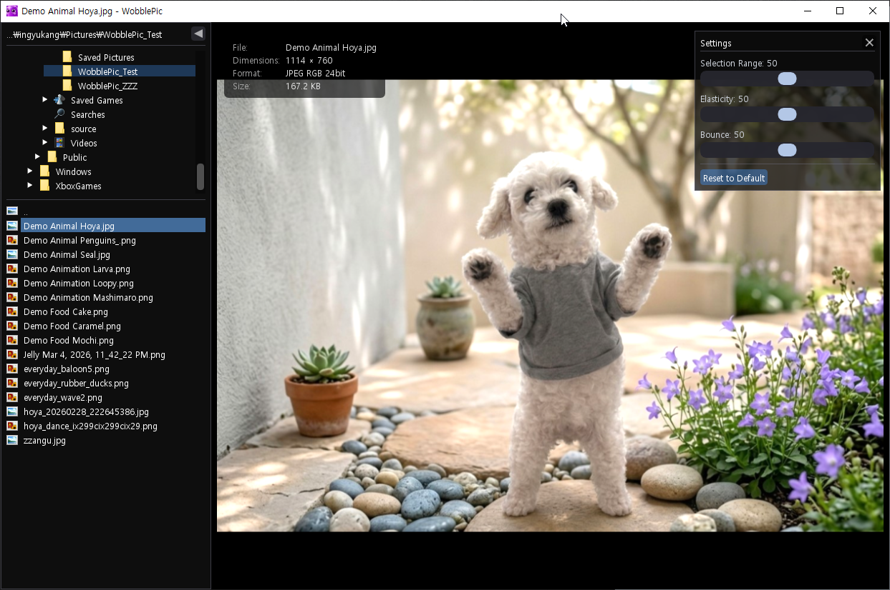

# WobblePic

[](https://www.wobblepic.com)
[](https://www.wobblepic.com/download)
[](https://www.wobblepic.com/download)

An interactive image viewer where you can grab and wobble images like jelly. Available for **Windows** and **macOS** (Apple Silicon & Intel).



## Features

- **Wobble Effect** — Click and drag on an image to stretch it like skin. Release to watch it spring back with inertia.
- **Smart Segmentation** — Click on an object to auto-detect its boundary using SAM2 (Segment Anything Model 2), then wobble just that object. Draw a box to select a region, Shift+click to add, Alt+click to subtract. Smooth mask boundaries via bilinear logits interpolation.
- **Pin Deformation** — Right-click or press P during wobble drag to pin the deformation in place. Pin up to 4 points, then wobble other areas while pins hold their shape.
- **Settings Panel** — Adjust Selection Range, Elasticity, and Bounce in real time via a translucent overlay panel.
- **Segment Zoom** — Ctrl+wheel to zoom only the selected segment while the background stays fixed.
- **Image Rotation** — R/L keys to rotate the image 90° clockwise/counter-clockwise.
- **File Explorer** — Built-in directory tree and file list for navigating folders and images. Right-click context menus, rename, and clipboard support.
- **GPU Accelerated** — OpenGL shader-based mesh deformation rendering at 60fps.
- **Wide GPU Support** — ONNX Runtime + DirectML backend supports AMD, NVIDIA, and Intel GPUs.
- **Wide Format Support** — JPG, PNG, BMP, GIF, WebP, TIFF, AVIF, HEIC/HEIF.
- **Drag & Drop** — Drop images or folders from Explorer/Finder to open them instantly.
- **DPI Scaling** — Automatic Per-Monitor V2 DPI scaling for fonts, icons, panels, and window size.
- **EXIF Auto-Rotation** — Automatically rotates images based on EXIF orientation (e.g. smartphone portrait photos).
- **Window State Memory** — Remembers window position, size, and maximized state across sessions.
- **Ad-Free License** — Optional $3 one-time purchase to remove ads and unlock premium features (directory tree, panel customization).

## Download

Download the latest installer from the [Releases](https://github.com/wobblepic/WobblePicPublic/releases) page.

## System Requirements

### Windows
- Windows 10 or later (64-bit)
- OpenGL 3.3+ GPU
- DirectML-compatible GPU (AMD / NVIDIA / Intel) recommended for AI segmentation
- 4 GB RAM minimum (8 GB recommended), ~600 MB disk (SAM2 included)

### macOS
- macOS Sequoia or later
- Apple Silicon (M1 / M2 / M3 / M4) or Intel Mac
- Apple Silicon uses Neural Engine (CoreML) for fast AI segmentation; Intel Mac uses ONNX Runtime CPU
- 4 GB RAM minimum (8 GB recommended), ~600 MB disk (SAM2 included)

## Installation

### Windows

1. Download `WobblePic_Setup_X.X.X.exe` from [Releases](https://github.com/wobblepic/WobblePicPublic/releases).
2. Run the installer and follow the instructions.
3. Launch WobblePic from the Start Menu or Desktop shortcut.

### macOS

1. Download the DMG matching your Mac from [Releases](https://github.com/wobblepic/WobblePicPublic/releases):
   - Apple Silicon: `WobblePic-X.X.X-arm64.dmg`
   - Intel Mac: `WobblePic-X.X.X-x64.dmg`
2. Open the DMG and drag **WobblePic.app** into the Applications folder.
3. On first launch, macOS may block the app as unsigned. Open **System Settings → Privacy & Security** and click **Open Anyway**.

Alternative (Terminal):

```bash
sudo xattr -rd com.apple.quarantine /Applications/WobblePic.app
```

## Usage

```
WobblePic [image_path_or_folder]
```

> **macOS users:** Replace `Ctrl` with `Cmd` and `Alt` with `Option` throughout. Trackpad pinch-to-zoom is also supported.

- **Click + drag** on an object to wobble it.
- **Drag outside mask** to draw a box and select a region.
- **Shift + click/drag** to add to the segment, **Alt + click/drag** to subtract.
- **Right-click** or **P** during drag to pin the deformation.
- **Click** on a red pin dot to release it.
- **Click** outside the wobble area to select a different object.
- **Ctrl + drag** to move the selected segment.
- **Ctrl + wheel** to zoom the selected segment only.
- **Mouse wheel** to zoom, **Space + drag** or **middle-click + drag** to pan.
- **R** / **L** to rotate the image 90° clockwise / counter-clockwise.
- **Arrow keys** or **Space/Backspace** to navigate images.
- **Delete** to move the current file to the Recycle Bin.
- **ESC** to release all pins and clear segmentation.
- **Ctrl + B** to toggle the file explorer panel.
- **I** to toggle image info overlay, **Tab** to switch panel focus, **F1** for tutorial.
- **Right-click** on the image area for context menu (Edit, Print, Copy, Delete).

## License

WobblePic is freeware. Free to use, not for redistribution or modification.
